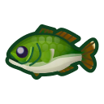

# fishing-api

This is a rewrite of Brandon Lockaby's fishing bot for Multiplayer Piano.

This project is a complete overhaul over the original script.

This project was created using `bun init` in bun v1.0.25. [Bun](https://bun.sh) is a fast all-in-one JavaScript runtime.

## Deployment

Firstly, a PostgreSQL database must be ready beforehand to connect to with a URI. This shoud be self-explanatory to setup.

Copy the default `.env` file:

```bash
cp .env.template .env
```

Edit that file to match your environment. Keep in mind that a connection token is required for all fishing service clients. These clients are for connecting to the actual service (such as Discord or MPP) and bridges the connection to the backend API. This way, the execution related to fishing itself is focused in its own process, instead of travelling between sending messages and processing fishing-related computations.

Next, install the project's dependencies from npm:

```bash
bun install
bunx prisma db push
```

Run both the HTTP API and the clients for various services separately with these commands:

```bash
bun . # Main http server
```

```bash
bun src/mpp/index.ts # MPP bot
```

```bash
bun src/discord/index.ts # Discord bot
```

```bash
bun src/cli/index.ts # Command-line client (for debugging)
```
